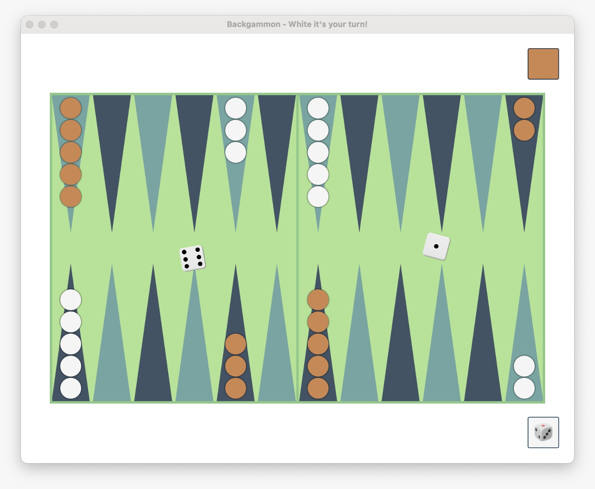

# Backgammon

[](https://github.com/jo351pau/SE-Boger/actions/workflows/build_and_test.yml) [](https://coveralls.io/github/jo351pau/SE-Boger?branch=main) [](https://opensource.org/licenses/MIT)




This is an open-source project that implements the classic board game Backgammon using the Scala programming language. This project aims to provide a scalable, maintainable, and extensible codebase for Backgammon enthusiasts and developers alike.

## Data Storage

This project supports data storage in both JSON and XML formats. You can save and load your game data using the provided serialization functionalities. Simply import the corresponding class into the `de.htwg.se.backgammon.Main` class.

* JSON: `import de.htwg.se.backgammon.model.storage.JsonStorage.{given}`
* XML: `import de.htwg.se.backgammon.model.storage.XmlStorage.{given}`   

By implementing the following `Storage` trait,
you gain the flexibility to effortlessly support various serialization formats.
```scala
trait Storage {
 def load[O <: Storable](parser: Parser[_ <: Storable], path: String): Try[O]
 def fileExtension: String
 def parse[O <: Storable](obj: O): String 
}
```

## Customizable Appearance
The Scala Backgammon application offers an easily customizable appearance through the `ColorPalette` trait. This trait allows you to define color schemes, enabling you to personalize the visual style of the game. By implementing the `ColorPalette` trait, you can override specific color properties to tailor the look and feel according to your preferences.  
**In an upcoming release, we plan to introduce the ability to determine the color scheme through a configuration file.**
```scala
trait ColorPalette {

  // Board
  def boardBackground: Color
  def boardGrid: Color

  // Field 
  def field: Color
  def field_1: Color

  // Checkers
  def checkersWhite: Color
  def checkersBlack: Color
}
```

## Customizable Size and Resolution
Customize the application's size and resolution in the `de.htwg.se.backgammon.view.component.configuration.Default` class. Easily locate and adjust properties or methods to fine-tune the user interface dimensions to your preferences.

## Customizable Backgammon Experience

Whether you prefer a smaller board for faster gameplay or want to experiment with diverse game figure quantities, the flexibility is yours. Simply adjust these variables in the `Main` class to redefine your gaming environment.
```scala
val NUMBER_OF_FIELDS = 24
val NUMBER_OF_FIGURES = 15
```
#### Additional Options
* Customize the starting distribution of the game figures by using a `CustomSetup`.
* Edit the game structure according to your preferences using the XML/JSON file. 


## Contributing

We welcome contributions from the community! If you'd like to contribute to Scala Backgammon, please follow these steps:

1. Fork the repository.
2. Create a new branch for your feature/bugfix: `git checkout -b feature-name`
3. Implement your changes.
4. Test thoroughly.
5. Create a pull request.

## License

This project is licensed under the MIT License - see the [LICENSE.md](LICENSE.md) file for details.

## Acknowledgments

- [Scala Documentation](https://docs.scala-lang.org/)
- [Backgammon Rules](https://www.bkgm.com/rules.html)